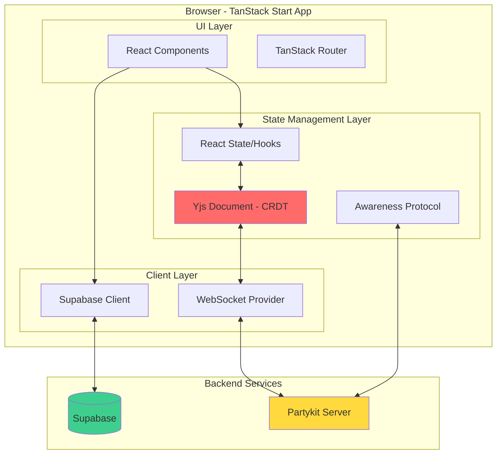
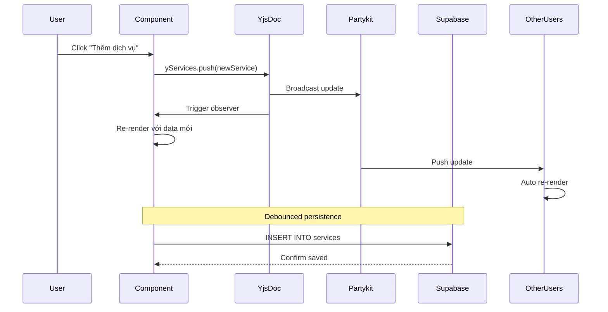
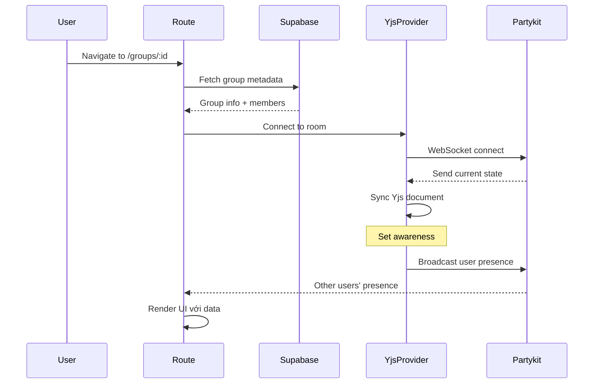
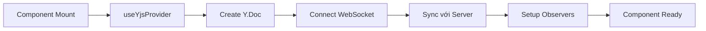
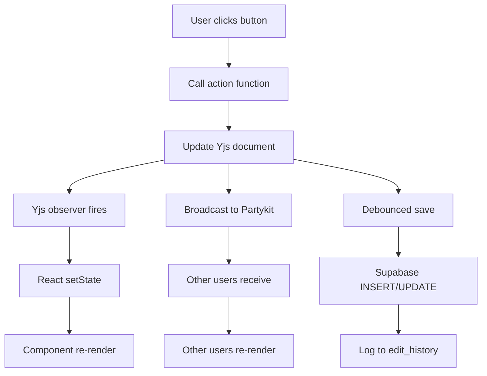
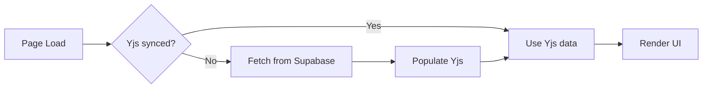

# Kiến trúc & Quản lý State

## 1. Tổng quan Kiến trúc



---

## 2. Luồng Dữ liệu (Data Flow)

### 2.1. Khi User Tạo/Sửa Service



**Key Points:**

- ✅ Yjs = Source of truth cho real-time
- ✅ Supabase = Persistence layer (debounced)
- ✅ Optimistic updates (không cần đợi server)

---

### 2.2. Khi User Vào Group



---

## 3. State Management Chi Tiết

### 3.1. Phân Loại State

| State Type              | Storage        | Sync         | Example                      |
| ----------------------- | -------------- | ------------ | ---------------------------- |
| **Server State**        | Supabase       | Manual fetch | Groups, Members, Auth        |
| **Collaborative State** | Yjs + Partykit | Real-time    | Services, Contributions      |
| **Ephemeral State**     | Awareness      | Real-time    | Cursor position, Focus       |
| **Local UI State**      | React useState | None         | Modal open/close, Form input |

---

### 3.2. Yjs Document Structure

```typescript
// Cấu trúc Yjs document cho 1 group
interface YjsGroupDocument {
  // Shared arrays/maps
  services: Y.Array<YService> // Danh sách dịch vụ
  people: Y.Array<string> // Danh sách người trong group
  contributions: Y.Map<YContribution> // Key: `${serviceId}-${personId}`

  // Metadata (không cần sync real-time)
  // → Lưu ở Supabase, fetch 1 lần
}

interface YService {
  id: string
  name: string
  cost: number
  createdBy: string
  createdAt: number
}

interface YContribution {
  serviceId: string
  personId: string
  used: boolean
  paid: number
}
```

---

### 3.3. React Hook Pattern

```typescript
// Hook chính để dùng trong components
export const useMoneyCalc = (groupId: string) => {
  const { doc, provider } = useYjsProvider(groupId)

  // 1. Yjs shared types
  const yServices = useMemo(() => doc.getArray<YService>('services'), [doc])
  const yPeople = useMemo(() => doc.getArray<string>('people'), [doc])
  const yContributions = useMemo(() => doc.getMap<YContribution>('contributions'), [doc])

  // 2. React state sync với Yjs
  const [services, setServices] = useState<YService[]>([])
  const [people, setPeople] = useState<string[]>([])

  // 3. Observer để sync Yjs → React
  useEffect(() => {
    const syncServices = () => setServices(yServices.toArray())
    const syncPeople = () => setPeople(yPeople.toArray())

    syncServices() // Initial sync
    syncPeople()

    yServices.observe(syncServices)
    yPeople.observe(syncPeople)

    return () => {
      yServices.unobserve(syncServices)
      yPeople.unobserve(syncPeople)
    }
  }, [yServices, yPeople])

  // 4. Actions (mutations)
  const addService = useCallback(
    (name: string, cost: number) => {
      const newService: YService = {
        id: nanoid(),
        name,
        cost,
        createdBy: user.id,
        createdAt: Date.now(),
      }

      // Update Yjs (auto broadcast)
      yServices.push([newService])

      // Debounced save to Supabase
      debouncedSaveToSupabase(groupId, newService)
    },
    [yServices, groupId, user]
  )

  return {
    services,
    people,
    addService,
    removeService,
    updateService,
    // ...
  }
}
```

---

## 4. Vòng Đời (Lifecycle)

### 4.1. Component Mount



**Code:**

```typescript
const GroupPage = ({ groupId }: { groupId: string }) => {
  // 1. Connect to Yjs
  const { doc, provider, status } = useYjsProvider(groupId)

  // 2. Setup state
  const { services, addService } = useMoneyCalc(groupId)

  // 3. Setup awareness
  const { onlineUsers, focusedElements } = useAwareness(provider)

  if (status === 'connecting') return <Loading />
  if (status === 'error') return <Error />

  return <GroupUI services={services} onlineUsers={onlineUsers} />
}
```

---

### 4.2. User Action Lifecycle



---

### 4.3. Component Unmount

```typescript
useEffect(() => {
  // Setup
  const provider = new WebsocketProvider(...)

  return () => {
    // Cleanup
    provider.awareness.setLocalState(null) // Remove presence
    provider.disconnect()
    provider.destroy()
  }
}, [groupId])
```

---

## 5. Awareness (Presence) System

### 5.1. Awareness State Structure

```typescript
interface AwarenessState {
  user: {
    id: string
    name: string
    avatar?: string
    color: string // Generated từ user.id
  }
  cursor?: {
    x: number
    y: number
  }
  focusedElement?: {
    type: 'service' | 'contribution' | 'person'
    id: string
  }
  lastActive: number
}
```

### 5.2. Tracking Focus

```typescript
const ServiceCard = ({ service }: { service: YService }) => {
  const { provider } = useYjsProvider()

  const handleFocus = () => {
    provider.awareness.setLocalStateField('focusedElement', {
      type: 'service',
      id: service.id
    })
  }

  const handleBlur = () => {
    provider.awareness.setLocalStateField('focusedElement', null)
  }

  return (
    <Card onFocus={handleFocus} onBlur={handleBlur}>
      <FocusIndicator serviceId={service.id} />
      {/* ... */}
    </Card>
  )
}
```

### 5.3. Hiển thị Presence

```typescript
const FocusIndicator = ({ serviceId }: { serviceId: string }) => {
  const { onlineUsers } = useAwareness()

  const usersOnThisService = onlineUsers.filter(
    u => u.focusedElement?.type === 'service'
      && u.focusedElement.id === serviceId
  )

  if (usersOnThisService.length === 0) return null

  return (
    <div className="absolute -top-2 -right-2">
      {usersOnThisService.map(user => (
        <Avatar
          key={user.id}
          src={user.avatar}
          style={{ borderColor: user.color }}
        />
      ))}
    </div>
  )
}
```

---

## 6. Persistence Strategy

### 6.1. Khi Nào Lưu Supabase?

```typescript
// Debounced save - chỉ lưu sau 2s không có thay đổi
const debouncedSave = useDebouncedCallback(
  async (groupId: string, data: any) => {
    await supabase.from('services').upsert(data)

    // Log edit history
    await supabase.from('edit_history').insert({
      group_id: groupId,
      user_id: user.id,
      action: 'update_service',
      entity_type: 'service',
      entity_id: data.id,
      new_value: data,
    })
  },
  2000 // 2 seconds
)
```

### 6.2. Initial Load Strategy



**Code:**

```typescript
const useInitialLoad = (groupId: string) => {
  const { doc, provider, synced } = useYjsProvider(groupId)
  const [loading, setLoading] = useState(true)

  useEffect(() => {
    const init = async () => {
      if (synced) {
        // Yjs đã sync → dùng luôn
        setLoading(false)
        return
      }

      // Chưa sync → fetch từ Supabase
      const { data } = await supabase.from('services').select('*').eq('group_id', groupId)

      // Populate Yjs
      const yServices = doc.getArray('services')
      yServices.push(data)

      setLoading(false)
    }

    init()
  }, [groupId, synced])

  return { loading }
}
```

---

## 7. Conflict Resolution

### 7.1. Yjs Tự Động Resolve Conflicts

```typescript
// Scenario: 2 users cùng edit service name
// User A: "Ăn sáng" → "Ăn sáng KFC"
// User B: "Ăn sáng" → "Ăn sáng Lotteria"

// Yjs sẽ merge thành: "Ăn sáng KFC Lotteria"
// (Last Write Wins cho primitive values)
```

### 7.2. Custom Conflict Handling

```typescript
// Nếu muốn Last Write Wins cho object
const updateServiceName = (id: string, newName: string) => {
  const yServices = doc.getArray('services')
  const index = yServices.toArray().findIndex((s) => s.id === id)

  if (index !== -1) {
    // Delete old + Insert new = Last Write Wins
    yServices.delete(index, 1)
    yServices.insert(index, [
      {
        ...yServices.get(index),
        name: newName,
        updatedAt: Date.now(), // Timestamp để track
      },
    ])
  }
}
```

---

## 8. Performance Considerations

### 8.1. Optimization Strategies

1. **Debounced Supabase Writes**: Giảm database calls
2. **Memoization**: `useMemo` cho computed values
3. **Selective Re-renders**: React.memo cho components
4. **Lazy Loading**: Code splitting cho routes

### 8.2. Example: Computed Values

```typescript
const useComputedResults = (services: YService[], contributions: Map<string, YContribution>) => {
  return useMemo(() => {
    // Heavy calculation
    return calculateTransactions(services, contributions)
  }, [services, contributions]) // Chỉ re-compute khi thay đổi
}
```

---

## Tóm tắt

| Aspect                  | Solution                    |
| ----------------------- | --------------------------- |
| **Real-time sync**      | Yjs + Partykit WebSocket    |
| **Persistence**         | Supabase (debounced)        |
| **Presence**            | Awareness Protocol          |
| **State management**    | React hooks + Yjs observers |
| **Conflict resolution** | Yjs CRDT (automatic)        |
| **Performance**         | Memoization + debouncing    |
