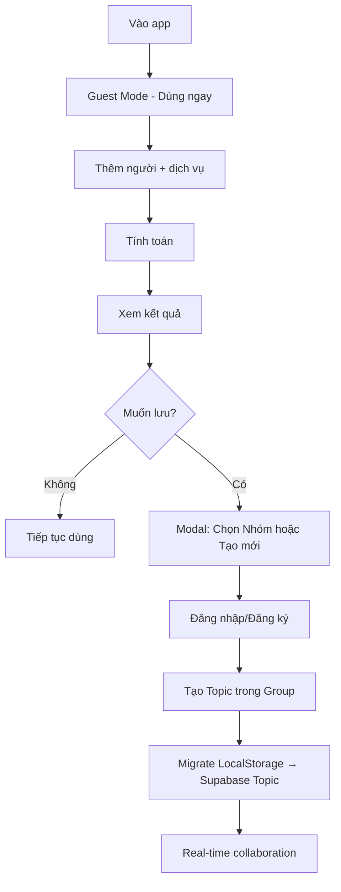
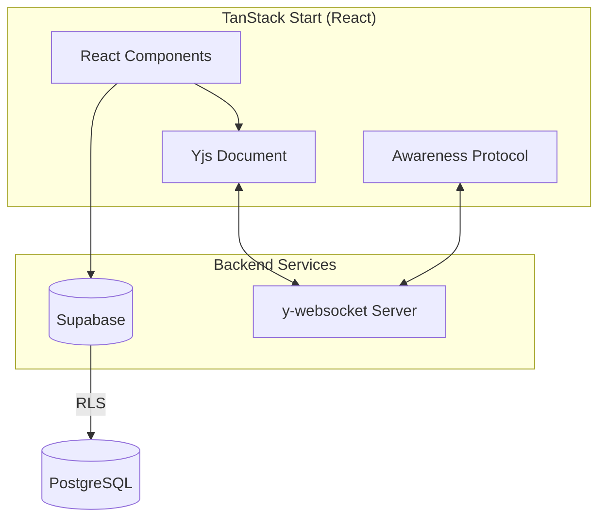

# Migration Plan: SvelteKit → TanStack Start + Supabase + Yjs

## Tổng quan

Migrate ứng dụng chia tiền từ SvelteKit sang TanStack Start (React) với **guest-first authentication**:

- **Guest Mode**: Dùng ngay không cần đăng nhập (LocalStorage)
- **Contextual Auth**: Đăng nhập khi muốn lưu nhóm
- **Supabase**: Authentication + Database + Realtime
- **Yjs**: Real-time collaboration (CRDT) - chỉ cho authenticated users
- **Presence/Awareness**: Cursor tracking như Figma - chỉ cho authenticated users

---

## User Flow



---

## User Review Required

> [!IMPORTANT]
> **Guest-First Flow**: User có thể dùng app ngay không cần đăng nhập. Data lưu trong LocalStorage. Khi muốn lưu vĩnh viễn, mới yêu cầu đăng nhập.

> [!IMPORTANT]
> **Tạo Supabase Project**: Bạn cần tạo project trên [supabase.com](https://supabase.com) và cung cấp `SUPABASE_URL` + `SUPABASE_ANON_KEY`.

> [!IMPORTANT]
> **Yjs WebSocket Server**: Chỉ dùng cho authenticated users. Cần quyết định hosting cho y-websocket server (Partykit recommended).

---

## Architecture Overview



---

## Proposed Changes

### 1. TanStack Start Project Setup

#### [NEW] [package.json](file:///Users/mac/Documents/Individuals/chia-tien/chia-tien-tanstack-start/package.json)

Khởi tạo project với các dependencies:

- `@tanstack/react-start`, `@tanstack/react-router`, `@tanstack/react-store`
- `@supabase/supabase-js`, `@supabase/ssr`
- `yjs`, `y-websocket`
- `tailwindcss@4`, `class-variance-authority`, `clsx`, `tailwind-merge`
- `nanoid`, `sonner` (utilities)

#### [NEW] [app.config.ts](file:///Users/mac/Documents/Individuals/chia-tien/chia-tien-tanstack-start/app.config.ts)

TanStack Start configuration với React plugin.

---

### 2. Supabase Database Schema

#### [NEW] [supabase/migrations/001_initial_schema.sql](file:///Users/mac/Documents/Individuals/chia-tien/chia-tien-tanstack-start/supabase/migrations/001_initial_schema.sql)

```sql
-- Users (auto từ Supabase Auth)

-- Groups (Tập hợp người dùng cố định)
CREATE TABLE groups (
  id UUID PRIMARY KEY DEFAULT gen_random_uuid(),
  name TEXT NOT NULL,
  description TEXT,
  owner_id UUID REFERENCES auth.users(id) ON DELETE CASCADE,
  created_at TIMESTAMPTZ DEFAULT now()
);

-- Topics (Chủ đề chia tiền cụ thể - ví dụ: "Phượt Đà Lạt")
CREATE TABLE topics (
  id UUID PRIMARY KEY DEFAULT gen_random_uuid(),
  group_id UUID REFERENCES groups(id) ON DELETE CASCADE,
  name TEXT NOT NULL,
  created_at TIMESTAMPTZ DEFAULT now()
);

-- Group Members
CREATE TABLE group_members (
  id UUID PRIMARY KEY DEFAULT gen_random_uuid(),
  group_id UUID REFERENCES groups(id) ON DELETE CASCADE,
  user_id UUID REFERENCES auth.users(id) ON DELETE CASCADE,
  role TEXT DEFAULT 'member' CHECK (role IN ('owner', 'admin', 'member')),
  display_name TEXT NOT NULL,
  invited_at TIMESTAMPTZ DEFAULT now(),
  UNIQUE(group_id, user_id)
);

-- Services (dịch vụ/khoản chi - gắn vào Topic)
CREATE TABLE services (
  id UUID PRIMARY KEY DEFAULT gen_random_uuid(),
  topic_id UUID REFERENCES topics(id) ON DELETE CASCADE,
  name TEXT NOT NULL,
  cost DECIMAL(12,2) NOT NULL DEFAULT 0,
  split_mode TEXT DEFAULT 'equal' CHECK (split_mode IN ('equal', 'quantity', 'percentage')),
  total_quantity DECIMAL(12,2),
  created_by UUID REFERENCES auth.users(id),
  created_at TIMESTAMPTZ DEFAULT now()
);

-- Contributions (ai dùng, ai trả)
CREATE TABLE contributions (
  id UUID PRIMARY KEY DEFAULT gen_random_uuid(),
  service_id UUID REFERENCES services(id) ON DELETE CASCADE,
  member_id UUID REFERENCES group_members(id) ON DELETE CASCADE,
  used BOOLEAN DEFAULT false,
  paid DECIMAL(12,2) DEFAULT 0,
  quantity DECIMAL(12,2),
  percentage DECIMAL(12,2),
  UNIQUE(service_id, member_id)
);

-- Edit History
CREATE TABLE edit_history (
  id UUID PRIMARY KEY DEFAULT gen_random_uuid(),
  group_id UUID REFERENCES groups(id) ON DELETE CASCADE,
  user_id UUID REFERENCES auth.users(id),
  action TEXT NOT NULL, -- 'add_service', 'update_service', 'add_member', etc.
  entity_type TEXT NOT NULL, -- 'service', 'contribution', 'member'
  entity_id UUID,
  old_value JSONB,
  new_value JSONB,
  created_at TIMESTAMPTZ DEFAULT now()
);
```

---

### 3. Supabase Authentication

#### [NEW] [src/lib/supabase/client.ts](file:///Users/mac/Documents/Individuals/chia-tien/chia-tien-tanstack-start/src/lib/supabase/client.ts)

```typescript
import { createBrowserClient } from '@supabase/ssr'

export const createClient = () =>
  createBrowserClient(import.meta.env.VITE_SUPABASE_URL, import.meta.env.VITE_SUPABASE_ANON_KEY)
```

#### [NEW] [src/lib/supabase/server.ts](file:///Users/mac/Documents/Individuals/chia-tien/chia-tien-tanstack-start/src/lib/supabase/server.ts)

Server-side Supabase client cho SSR.

#### [NEW] [src/hooks/useAuth.ts](file:///Users/mac/Documents/Individuals/chia-tien/chia-tien-tanstack-start/src/hooks/useAuth.ts)

Auth hook với `onAuthStateChange`, `signIn`, `signOut`, `signUp`.

---

### 4. Route Structure (Guest-First)

```
src/routes/
├── __root.tsx              # Root layout
├── index.tsx               # Landing = Calculator (Guest Mode)
├── _auth.tsx               # Auth layout (protected routes)
└── _auth/
    ├── dashboard.tsx       # Dashboard với danh sách groups
    ├── groups/
    │   ├── $groupId.tsx    # Danh sách các Topics trong Group
    │   └── _topics/
    │       └── $topicId.tsx # Calculator Real-time cho Topic cụ thể
    └── settings.tsx        # User settings
```

**Key Changes:**

- ❌ Không có `/login`, `/signup` riêng → Auth inline trong modal
- ❌ Không có `/groups/new` → Tạo group khi save từ guest mode
- ✅ Landing page = Calculator luôn (guest mode)
- ✅ Protected routes chỉ cho authenticated users

---

### 5. Guest Mode Implementation

#### [NEW] [src/stores/local/guest.store.ts](file:///Users/mac/Documents/Individuals/chia-tien/chia-tien-tanstack-start/src/stores/local/guest.store.ts)

Guest mode store với LocalStorage persistence:

```typescript
import { Store } from '@tanstack/store'

interface GuestState {
  people: string[]
  services: Service[]
  contributions: Record<string, Contribution>
}

export const guestStore = new Store<GuestState>({
  people: [],
  services: [],
  contributions: {},
})

// Auto-save to localStorage
guestStore.subscribe((state) => {
  localStorage.setItem('guestData', JSON.stringify(state))
})

// Load from localStorage on init
const savedData = localStorage.getItem('guestData')
if (savedData) {
  guestStore.setState(JSON.parse(savedData))
}

// Actions
export const addGuestPerson = (name: string) => {
  guestStore.setState((s) => ({
    people: [...s.people, name],
  }))
}

export const addGuestService = (service: Service) => {
  guestStore.setState((s) => ({
    services: [...s.services, service],
  }))
}
```

#### [NEW] [src/components/SaveGroupModal.tsx](file:///Users/mac/Documents/Individuals/chia-tien/chia-tien-tanstack-start/src/components/SaveGroupModal.tsx)

Modal kết hợp tên nhóm + auth inline:

```typescript
export const SaveGroupModal = ({ isOpen, onClose }: Props) => {
  const [groupName, setGroupName] = useState('')
  const [email, setEmail] = useState('')
  const [password, setPassword] = useState('')
  const [isSignup, setIsSignup] = useState(false)

  const handleSave = async () => {
    // 1. Authenticate
    const { data: { user }, error } = isSignup
      ? await supabase.auth.signUp({ email, password })
      : await supabase.auth.signInWithPassword({ email, password })

    if (error) {
      toast.error(error.message)
      return
    }

    // 2. Migrate guest data to Supabase
    await migrateGuestToGroup(groupName, user!)

    // 3. Redirect to dashboard
    router.push('/dashboard')
  }

  return (
    <Modal open={isOpen} onClose={onClose}>
      <Input
        label="Đặt tên cho nhóm này"
        value={groupName}
        onChange={setGroupName}
        placeholder="Ăn sáng team"
        autoFocus
      />

      <Divider>Đăng nhập để lưu vĩnh viễn</Divider>

      <Input label="Email" value={email} onChange={setEmail} />
      <Input label="Mật khẩu" type="password" value={password} onChange={setPassword} />

      <Button onClick={handleSave}>💾 Lưu và đăng nhập</Button>

      <Divider>hoặc</Divider>

      <GoogleButton onClick={handleGoogleAuth} />

      <Toggle>
        {isSignup ? 'Đã có tài khoản?' : 'Chưa có tài khoản?'}
        <Link onClick={() => setIsSignup(!isSignup)}>
          {isSignup ? 'Đăng nhập' : 'Đăng ký ngay'}
        </Link>
      </Toggle>
    </Modal>
  )
}
```

#### [NEW] [src/lib/migration.ts](file:///Users/mac/Documents/Individuals/chia-tien/chia-tien-tanstack-start/src/lib/migration.ts)

Migration logic từ guest → authenticated:

```typescript
export const migrateGuestToGroup = async (groupName: string, userId: string) => {
  const guestData = guestStore.state

  // 1. Create group
  const { data: group, error: groupError } = await supabase
    .from('groups')
    .insert({
      name: groupName,
      owner_id: userId,
    })
    .select()
    .single()

  if (groupError) throw groupError

  // 2. Add owner as member
  await supabase.from('group_members').insert({
    group_id: group.id,
    user_id: userId,
    role: 'owner',
    display_name: guestData.people[0] || 'Me',
  })

  // 3. Migrate services
  const servicesWithGroupId = guestData.services.map((s) => ({
    ...s,
    group_id: group.id,
    created_by: userId,
  }))

  await supabase.from('services').insert(servicesWithGroupId)

  // 4. Migrate contributions
  // ... (similar logic)

  // 5. Clear guest data
  localStorage.removeItem('guestData')
  guestStore.setState({
    people: [],
    services: [],
    contributions: {},
  })

  // 6. Log activity
  await supabase.from('edit_history').insert({
    group_id: group.id,
    user_id: userId,
    action: 'create_group',
    entity_type: 'group',
    entity_id: group.id,
    new_value: { name: groupName, from_guest: true },
  })

  return group
}
```

---

### 6. Yjs Real-time Collaboration (Authenticated Only)

> [!NOTE]
> Yjs chỉ được sử dụng cho authenticated users trong group detail page. Guest mode dùng LocalStorage.

#### [NEW] [src/lib/yjs/provider.tsx](file:///Users/mac/Documents/Individuals/chia-tien/chia-tien-tanstack-start/src/lib/yjs/provider.tsx)

```typescript
import * as Y from 'yjs'
import { WebsocketProvider } from 'y-websocket'

export const createYjsProvider = (groupId: string, user: User) => {
  const doc = new Y.Doc()

  const provider = new WebsocketProvider('wss://your-yjs-server.com', `group-${groupId}`, doc)

  // Setup awareness cho cursor presence
  provider.awareness.setLocalStateField('user', {
    id: user.id,
    name: user.name,
    color: generateUserColor(user.id),
    focusedElement: null,
  })

  return { doc, provider }
}
```

#### [NEW] [src/lib/yjs/types.ts](file:///Users/mac/Documents/Individuals/chia-tien/chia-tien-tanstack-start/src/lib/yjs/types.ts)

Shared Yjs types cho services, contributions:

```typescript
// Yjs shared types
const yServices = doc.getArray<YService>('services')
const yContributions = doc.getMap<YContribution>('contributions')
const yPeople = doc.getArray<string>('people')
```

#### [NEW] [src/hooks/useYjsSync.ts](file:///Users/mac/Documents/Individuals/chia-tien/chia-tien-tanstack-start/src/hooks/useYjsSync.ts)

Hook để sync Yjs document với React state và Supabase.

---

### 6. Presence & Awareness Features

#### [NEW] [src/components/collaboration/CursorPresence.tsx](file:///Users/mac/Documents/Individuals/chia-tien/chia-tien-tanstack-start/src/components/collaboration/CursorPresence.tsx)

Hiển thị avatar/cursor của người đang online và focus vào element nào.

#### [NEW] [src/components/collaboration/OnlineUsers.tsx](file:///Users/mac/Documents/Individuals/chia-tien/chia-tien-tanstack-start/src/components/collaboration/OnlineUsers.tsx)

Danh sách người đang online.

#### [NEW] [src/components/collaboration/EditHistory.tsx](file:///Users/mac/Documents/Individuals/chia-tien/chia-tien-tanstack-start/src/components/collaboration/EditHistory.tsx)

Panel hiển thị lịch sử ai edit cái gì, khi nào.

---

### 7. UI Components Migration

Migrate từ Svelte → React:

| Svelte Component                       | React Component                |
| -------------------------------------- | ------------------------------ |
| `add-person-area.svelte`               | `AddPersonArea.tsx`            |
| `add-service-area.svelte`              | `AddServiceArea.tsx`           |
| `mobile-action-bar.svelte`             | `MobileActionBar.tsx`          |
| `onboarding-hero.svelte`               | `OnboardingHero.tsx`           |
| `result-area.svelte`                   | `ResultArea.tsx`               |
| `service-list.svelte`                  | `ServiceList.tsx`              |
| UI components (`button`, `card`, etc.) | UI components (React versions) |

---

### 8. State Management với TanStack Store + Yjs

Chuyển từ Svelte stores → **TanStack Store + Yjs** (Zero Prop Drilling + Atomic Design):

#### Store Organization

```
src/stores/
├── collaborative/      # Yjs-backed stores
│   ├── services.store.ts
│   ├── people.store.ts
│   └── contributions.store.ts
├── local/              # TanStack Store
│   ├── ui.store.ts
│   ├── forms.store.ts
│   └── computed.store.ts
└── presence/
    └── awareness.store.ts
```

#### Example: TanStack Store cho UI State

```typescript
// stores/local/ui.store.ts
import { Store } from '@tanstack/store'

interface UIState {
  isAddServiceSheetOpen: boolean
  isResultSheetOpen: boolean
  focusedServiceId: string | null
}

export const uiStore = new Store<UIState>({
  isAddServiceSheetOpen: false,
  isResultSheetOpen: false,
  focusedServiceId: null,
})

// Selectors (zero prop drilling!)
export const useIsAddServiceSheetOpen = () => uiStore.useSelector((s) => s.isAddServiceSheetOpen)

// Actions
export const openAddServiceSheet = () => {
  uiStore.setState({ isAddServiceSheetOpen: true })
}
```

#### Example: Yjs Store cho Collaborative State

```typescript
// stores/collaborative/services.store.ts
import { Store } from '@tanstack/store'
import * as Y from 'yjs'

interface ServicesState {
  services: Service[]
  yServices: Y.Array<Service> | null
}

export const servicesStore = new Store<ServicesState>({
  services: [],
  yServices: null,
})

export const initServicesStore = (doc: Y.Doc) => {
  const yServices = doc.getArray<Service>('services')

  const observer = () => {
    servicesStore.setState({ services: yServices.toArray() })
  }

  yServices.observe(observer)
  observer()

  servicesStore.setState({ yServices })
  return () => yServices.unobserve(observer)
}

// Selectors
export const useServices = () => servicesStore.useSelector((s) => s.services)

// Actions
export const addService = (service: Omit<Service, 'id'>) => {
  const { yServices } = servicesStore.state
  if (!yServices) return

  yServices.push([{ ...service, id: nanoid() }])
}
```

#### Component Usage (Zero Prop Drilling!)

```typescript
// Atom component
export const AddServiceButton = () => {
  return (
    <Button onClick={openAddServiceSheet}>
      Thêm dịch vụ
    </Button>
  )
}

// Organism component
export const ServiceList = () => {
  const services = useServices() // No props needed!

  return (
    <div>
      {services.map(s => <ServiceCard key={s.id} serviceId={s.id} />)}
    </div>
  )
}
```

**Benefits:**

- ✅ Zero prop drilling - components tự lấy data từ stores
- ✅ Atomic design - components nhỏ, modular, dễ test
- ✅ Type-safe với TypeScript
- ✅ Real-time sync với Yjs CRDT
- ✅ DevTools support (TanStack Store time-travel)

> [!NOTE]
> Chi tiết về store architecture xem thêm tại [state-management.md](file:///Users/mac/.gemini/antigravity/brain/d53d10c1-2b27-410d-ab20-5f991e9d2672/state-management.md)

---

## Verification Plan

### Automated Tests

1. **Unit Tests** (Vitest)

   ```bash
   cd chia-tien-tanstack-start
   pnpm test
   ```

   - Test calculation logic
   - Test Yjs sync hooks

2. **E2E Tests** (Playwright)

   ```bash
   pnpm test:e2e
   ```

   - Test auth flow
   - Test group creation
   - Test real-time collaboration

### Manual Verification

1. **Auth Flow**:
   - Đăng ký tài khoản mới
   - Đăng nhập/đăng xuất
   - OAuth với Google

2. **Group Management**:
   - Tạo group mới
   - Mời thành viên (copy link)
   - Thay đổi role thành viên

3. **Real-time Collaboration**:
   - Mở 2 tab/browser khác nhau
   - Thêm service ở tab 1 → thấy ngay ở tab 2
   - Thấy cursor/focus của người khác
   - Xem edit history

4. **Mobile Responsive**:
   - Test trên iOS Safari
   - Test trên Android Chrome
