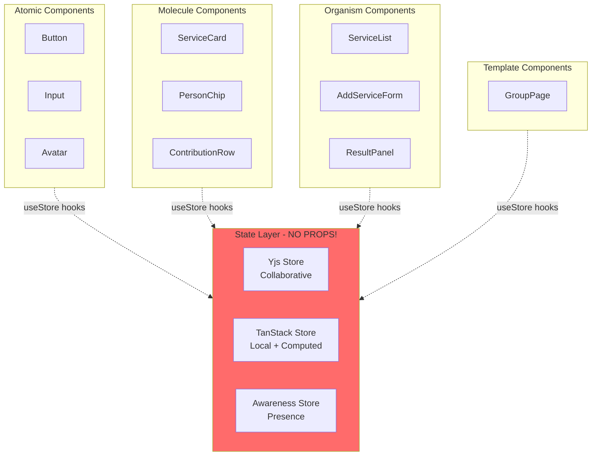
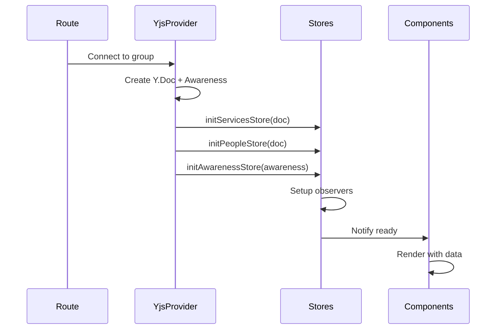

# State Management: Atomic Design + Zero Prop Drilling

## Kiến trúc Tổng quan



---

## 1. Store Organization

### 1.1. File Structure

```
src/
├── stores/
│   ├── collaborative/          # Yjs-backed stores
│   │   ├── services.store.ts
│   │   ├── people.store.ts
│   │   └── contributions.store.ts
│   │
│   ├── local/                  # TanStack Store
│   │   ├── ui.store.ts
│   │   ├── forms.store.ts
│   │   └── computed.store.ts
│   │
│   ├── presence/               # Awareness
│   │   └── awareness.store.ts
│   │
│   └── index.ts                # Re-exports
│
├── components/
│   ├── atoms/
│   ├── molecules/
│   ├── organisms/
│   └── templates/
```

---

## 2. TanStack Store Setup

### 2.1. UI Store (Local State)

```typescript
// stores/local/ui.store.ts
import { Store } from '@tanstack/store'

interface UIState {
  // Modals
  isAddServiceSheetOpen: boolean
  isAddPersonSheetOpen: boolean
  isResultSheetOpen: boolean
  isEditHistoryOpen: boolean

  // Focus states
  focusedServiceId: string | null
  focusedPersonId: string | null

  // Loading states
  isSaving: boolean
  isLoading: boolean
}

export const uiStore = new Store<UIState>({
  isAddServiceSheetOpen: false,
  isAddPersonSheetOpen: false,
  isResultSheetOpen: false,
  isEditHistoryOpen: false,
  focusedServiceId: null,
  focusedPersonId: null,
  isSaving: false,
  isLoading: false,
})

// Selectors (zero prop drilling!)
export const useIsAddServiceSheetOpen = () => uiStore.useSelector((s) => s.isAddServiceSheetOpen)

export const useIsResultSheetOpen = () => uiStore.useSelector((s) => s.isResultSheetOpen)

export const useFocusedServiceId = () => uiStore.useSelector((s) => s.focusedServiceId)

// Actions
export const openAddServiceSheet = () => {
  uiStore.setState((s) => ({ isAddServiceSheetOpen: true }))
}

export const closeAddServiceSheet = () => {
  uiStore.setState((s) => ({ isAddServiceSheetOpen: false }))
}

export const setFocusedService = (id: string | null) => {
  uiStore.setState((s) => ({ focusedServiceId: id }))
}
```

### 2.2. Form Store

```typescript
// stores/local/forms.store.ts
import { Store } from '@tanstack/store'

interface FormState {
  addService: {
    name: string
    cost: number
    errors: Record<string, string>
  }
  addPerson: {
    name: string
    errors: Record<string, string>
  }
}

export const formStore = new Store<FormState>({
  addService: {
    name: '',
    cost: 0,
    errors: {},
  },
  addPerson: {
    name: '',
    errors: {},
  },
})

// Selectors
export const useAddServiceForm = () => formStore.useSelector((s) => s.addService)

// Actions
export const setServiceName = (name: string) => {
  formStore.setState((s) => ({
    addService: { ...s.addService, name },
  }))
}

export const setServiceCost = (cost: number) => {
  formStore.setState((s) => ({
    addService: { ...s.addService, cost },
  }))
}

export const validateServiceForm = () => {
  const { name, cost } = formStore.state.addService
  const errors: Record<string, string> = {}

  if (!name.trim()) errors.name = 'Tên dịch vụ không được để trống'
  if (cost <= 0) errors.cost = 'Chi phí phải lớn hơn 0'

  formStore.setState((s) => ({
    addService: { ...s.addService, errors },
  }))

  return Object.keys(errors).length === 0
}

export const resetServiceForm = () => {
  formStore.setState((s) => ({
    addService: { name: '', cost: 0, errors: {} },
  }))
}
```

### 2.3. Computed Store

```typescript
// stores/local/computed.store.ts
import { Store } from '@tanstack/store'
import type { Transaction } from '@/types'

interface ComputedState {
  transactions: Transaction[]
  totals: Record<string, number>
  balances: Record<string, number>
}

export const computedStore = new Store<ComputedState>({
  transactions: [],
  totals: {},
  balances: {},
})

// Selectors
export const useTransactions = () => computedStore.useSelector((s) => s.transactions)

export const useTotals = () => computedStore.useSelector((s) => s.totals)

export const usePersonBalance = (personId: string) =>
  computedStore.useSelector((s) => s.balances[personId] ?? 0)

// Recompute function (gọi khi services/contributions thay đổi)
export const recomputeTransactions = (
  services: Service[],
  contributions: Map<string, Contribution>
) => {
  const transactions = calculateTransactions(services, contributions)
  const totals = calculateTotals(services, contributions)
  const balances = calculateBalances(transactions)

  computedStore.setState({ transactions, totals, balances })
}
```

---

## 3. Yjs Store (Collaborative State)

### 3.1. Services Store

```typescript
// stores/collaborative/services.store.ts
import { Store } from '@tanstack/store'
import * as Y from 'yjs'
import type { Service } from '@/types'

interface ServicesState {
  services: Service[]
  yServices: Y.Array<Service> | null
}

export const servicesStore = new Store<ServicesState>({
  services: [],
  yServices: null,
})

// Initialize với Yjs document
export const initServicesStore = (doc: Y.Doc) => {
  const yServices = doc.getArray<Service>('services')

  // Sync Yjs → TanStack Store
  const observer = () => {
    servicesStore.setState({ services: yServices.toArray() })

    // Trigger recompute
    recomputeTransactions(servicesStore.state.services, contributionsStore.state.contributions)
  }

  yServices.observe(observer)
  observer() // Initial sync

  servicesStore.setState({ yServices })

  return () => yServices.unobserve(observer)
}

// Selectors
export const useServices = () => servicesStore.useSelector((s) => s.services)

export const useService = (id: string) =>
  servicesStore.useSelector((s) => s.services.find((svc) => svc.id === id))

// Actions
export const addService = (service: Omit<Service, 'id'>) => {
  const { yServices } = servicesStore.state
  if (!yServices) return

  const newService: Service = {
    ...service,
    id: nanoid(),
    createdAt: Date.now(),
  }

  yServices.push([newService])

  // Debounced save to Supabase
  debouncedSaveService(newService)
}

export const updateService = (id: string, updates: Partial<Service>) => {
  const { yServices } = servicesStore.state
  if (!yServices) return

  const index = yServices.toArray().findIndex((s) => s.id === id)
  if (index === -1) return

  const current = yServices.get(index)
  yServices.delete(index, 1)
  yServices.insert(index, [{ ...current, ...updates }])

  debouncedSaveService({ ...current, ...updates })
}

export const removeService = (id: string) => {
  const { yServices } = servicesStore.state
  if (!yServices) return

  const index = yServices.toArray().findIndex((s) => s.id === id)
  if (index !== -1) {
    yServices.delete(index, 1)
    debouncedDeleteService(id)
  }
}
```

### 3.2. People Store

```typescript
// stores/collaborative/people.store.ts
import { Store } from '@tanstack/store'
import * as Y from 'yjs'

interface PeopleState {
  people: string[]
  yPeople: Y.Array<string> | null
}

export const peopleStore = new Store<PeopleState>({
  people: [],
  yPeople: null,
})

export const initPeopleStore = (doc: Y.Doc) => {
  const yPeople = doc.getArray<string>('people')

  const observer = () => {
    peopleStore.setState({ people: yPeople.toArray() })
  }

  yPeople.observe(observer)
  observer()

  peopleStore.setState({ yPeople })

  return () => yPeople.unobserve(observer)
}

// Selectors
export const usePeople = () => peopleStore.useSelector((s) => s.people)

export const usePeopleCount = () => peopleStore.useSelector((s) => s.people.length)

// Actions
export const addPerson = (name: string) => {
  const { yPeople } = peopleStore.state
  if (!yPeople) return

  if (yPeople.toArray().includes(name)) {
    toast.error('Người này đã tồn tại')
    return
  }

  yPeople.push([name])
}

export const removePerson = (name: string) => {
  const { yPeople } = peopleStore.state
  if (!yPeople) return

  const index = yPeople.toArray().indexOf(name)
  if (index !== -1) {
    yPeople.delete(index, 1)
  }
}
```

---

## 4. Awareness Store (Presence)

```typescript
// stores/presence/awareness.store.ts
import { Store } from '@tanstack/store'
import type { Awareness } from 'y-protocols/awareness'

interface UserPresence {
  id: string
  name: string
  avatar?: string
  color: string
  focusedElement?: {
    type: 'service' | 'person' | 'contribution'
    id: string
  }
  cursor?: { x: number; y: number }
  lastActive: number
}

interface AwarenessState {
  onlineUsers: UserPresence[]
  awareness: Awareness | null
}

export const awarenessStore = new Store<AwarenessState>({
  onlineUsers: [],
  awareness: null,
})

export const initAwarenessStore = (awareness: Awareness, currentUser: User) => {
  // Set local state
  awareness.setLocalStateField('user', {
    id: currentUser.id,
    name: currentUser.name,
    avatar: currentUser.avatar,
    color: generateUserColor(currentUser.id),
    lastActive: Date.now(),
  })

  // Observe changes
  const observer = () => {
    const states = Array.from(awareness.getStates().values())
    const users = states.filter((s) => s.user).map((s) => s.user as UserPresence)

    awarenessStore.setState({ onlineUsers: users })
  }

  awareness.on('change', observer)
  observer()

  awarenessStore.setState({ awareness })

  return () => awareness.off('change', observer)
}

// Selectors
export const useOnlineUsers = () => awarenessStore.useSelector((s) => s.onlineUsers)

export const useUsersOnElement = (type: string, id: string) =>
  awarenessStore.useSelector((s) =>
    s.onlineUsers.filter((u) => u.focusedElement?.type === type && u.focusedElement.id === id)
  )

// Actions
export const setFocusedElement = (type: string, id: string) => {
  const { awareness } = awarenessStore.state
  if (!awareness) return

  awareness.setLocalStateField('user', {
    ...awareness.getLocalState()?.user,
    focusedElement: { type, id },
    lastActive: Date.now(),
  })
}

export const clearFocusedElement = () => {
  const { awareness } = awarenessStore.state
  if (!awareness) return

  awareness.setLocalStateField('user', {
    ...awareness.getLocalState()?.user,
    focusedElement: undefined,
    lastActive: Date.now(),
  })
}
```

---

## 5. Component Examples (Zero Prop Drilling!)

### 5.1. Atom: Button

```typescript
// components/atoms/AddServiceButton.tsx
import { openAddServiceSheet } from '@/stores/local/ui.store'

export const AddServiceButton = () => {
  return (
    <Button onClick={openAddServiceSheet}>
      Thêm dịch vụ
    </Button>
  )
}
```

### 5.2. Molecule: ServiceCard

```typescript
// components/molecules/ServiceCard.tsx
import { useService } from '@/stores/collaborative/services.store'
import { useUsersOnElement } from '@/stores/presence/awareness.store'
import { setFocusedElement, clearFocusedElement } from '@/stores/presence/awareness.store'

export const ServiceCard = ({ serviceId }: { serviceId: string }) => {
  const service = useService(serviceId)
  const focusedUsers = useUsersOnElement('service', serviceId)

  if (!service) return null

  return (
    <Card
      onFocus={() => setFocusedElement('service', serviceId)}
      onBlur={clearFocusedElement}
    >
      <CardHeader>
        <CardTitle>{service.name}</CardTitle>
        {focusedUsers.length > 0 && (
          <AvatarGroup users={focusedUsers} />
        )}
      </CardHeader>
      <CardContent>
        {formatCurrency(service.cost)}
      </CardContent>
    </Card>
  )
}
```

### 5.3. Organism: ServiceList

```typescript
// components/organisms/ServiceList.tsx
import { useServices } from '@/stores/collaborative/services.store'

export const ServiceList = () => {
  const services = useServices()

  if (services.length === 0) {
    return <EmptyState />
  }

  return (
    <div className="space-y-4">
      {services.map(service => (
        <ServiceCard key={service.id} serviceId={service.id} />
      ))}
    </div>
  )
}
```

### 5.4. Organism: AddServiceSheet

```typescript
// components/organisms/AddServiceSheet.tsx
import { useIsAddServiceSheetOpen, closeAddServiceSheet } from '@/stores/local/ui.store'
import { useAddServiceForm, setServiceName, setServiceCost, validateServiceForm, resetServiceForm } from '@/stores/local/forms.store'
import { addService } from '@/stores/collaborative/services.store'

export const AddServiceSheet = () => {
  const isOpen = useIsAddServiceSheetOpen()
  const form = useAddServiceForm()

  const handleSubmit = () => {
    if (!validateServiceForm()) return

    addService({
      name: form.name,
      cost: form.cost
    })

    resetServiceForm()
    closeAddServiceSheet()
  }

  return (
    <Sheet open={isOpen} onOpenChange={closeAddServiceSheet}>
      <SheetContent>
        <SheetHeader>
          <SheetTitle>Thêm dịch vụ</SheetTitle>
        </SheetHeader>

        <div className="space-y-4">
          <Input
            placeholder="Tên dịch vụ"
            value={form.name}
            onChange={e => setServiceName(e.target.value)}
            error={form.errors.name}
          />

          <Input
            type="number"
            placeholder="Chi phí"
            value={form.cost}
            onChange={e => setServiceCost(Number(e.target.value))}
            error={form.errors.cost}
          />

          <Button onClick={handleSubmit}>Thêm</Button>
        </div>
      </SheetContent>
    </Sheet>
  )
}
```

### 5.5. Template: GroupPage

```typescript
// components/templates/GroupPage.tsx
import { useEffect } from 'react'
import { useYjsProvider } from '@/hooks/useYjsProvider'
import { initServicesStore } from '@/stores/collaborative/services.store'
import { initPeopleStore } from '@/stores/collaborative/people.store'
import { initAwarenessStore } from '@/stores/presence/awareness.store'

export const GroupPage = ({ groupId }: { groupId: string }) => {
  const { doc, provider, awareness } = useYjsProvider(groupId)
  const { user } = useAuth()

  // Initialize stores
  useEffect(() => {
    const cleanupServices = initServicesStore(doc)
    const cleanupPeople = initPeopleStore(doc)
    const cleanupAwareness = initAwarenessStore(awareness, user)

    return () => {
      cleanupServices()
      cleanupPeople()
      cleanupAwareness()
    }
  }, [doc, awareness, user])

  return (
    <div className="container">
      <Header />
      <OnlineUsers />
      <ServiceList />
      <ResultPanel />
      <AddServiceSheet />
      <AddPersonSheet />
    </div>
  )
}
```

---

## 6. Benefits

✅ **Zero Prop Drilling**: Mọi component tự lấy data từ store  
✅ **Atomic Design**: Components nhỏ, tái sử dụng, dễ test  
✅ **Type Safety**: TanStack Store + TypeScript  
✅ **Real-time Sync**: Yjs CRDT tự động  
✅ **DevTools**: TanStack Store có time-travel debugging  
✅ **Performance**: Selective re-renders với selectors  
✅ **Scalable**: Dễ thêm stores mới

---

## 7. Store Initialization Flow


