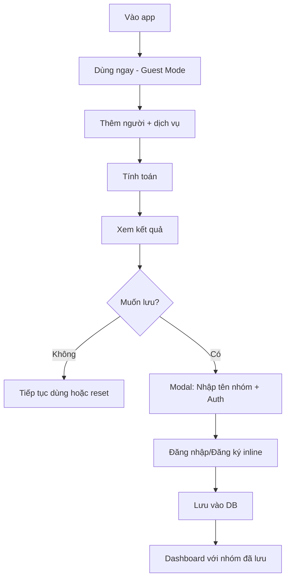

# UI/UX Design Specifications (Guest-First Flow)

Tài liệu mô tả chi tiết với **guest-first authentication** - user dùng ngay, đăng nhập khi cần lưu.

---

## 🎯 Core User Flow



---

## 1. Landing Page / Calculator (Guest Mode)

### Mô tả

Trang chủ = Calculator luôn. User vào là dùng ngay, không cần đăng nhập.

### Key Features

- **Instant use**: Không có barrier, dùng ngay
- Header đơn giản: Logo + "Đăng nhập" link (nhỏ, không nổi bật)
- Calculator chính giữa màn hình
- Add person/service buttons
- Service list với contribution checkboxes
- Result panel (sticky bottom)
- "Lưu nhóm này" CTA sau khi tính toán

### Layout

```
┌─────────────────────────────────────────────────┐
│  Chia Tiền 💰                    [Đăng nhập]    │
├─────────────────────────────────────────────────┤
│                                                 │
│         Chia tiền nhóm dễ dàng                  │
│         Không cần đăng nhập                     │
│                                                 │
│  ┌─────────────────────────────────────────┐   │
│  │                                         │   │
│  │  [+ Thêm người] [+ Thêm dịch vụ]       │   │
│  │                                         │   │
│  │  Người: 👤 An  👤 Bình  👤 Chi         │   │
│  │                                         │   │
│  │  Dịch vụ:                               │   │
│  │  ┌───────────────────────────────────┐ │   │
│  │  │ Ăn sáng              $100         │ │   │
│  │  │ ☑️ An  ☑️ Bình  ☐ Chi            │ │   │
│  │  │ Paid: An $50, Bình $50           │ │   │
│  │  └───────────────────────────────────┘ │   │
│  │                                         │   │
│  │  ┌───────────────────────────────────┐ │   │
│  │  │ Ăn trưa              $150         │ │   │
│  │  │ ☑️ An  ☑️ Bình  ☑️ Chi           │ │   │
│  │  └───────────────────────────────────┘ │   │
│  │                                         │   │
│  └─────────────────────────────────────────┘   │
│                                                 │
├─────────────────────────────────────────────────┤
│  💡 Kết quả: An trả Bình $25, Chi trả An $50   │
│                                                 │
│  [💾 Lưu nhóm này để dùng lại]                 │
└─────────────────────────────────────────────────┘
```

### Design Elements

- **Header**: Minimal, logo + login link (subtle)
- **Hero text**: Small, friendly, "Không cần đăng nhập"
- **Calculator card**: Centered, max-width 800px, white bg, shadow
- **Person chips**: Colored avatars, removable
- **Service cards**: Expandable, contribution matrix
- **Result panel**: Sticky bottom, gradient background, prominent
- **Save CTA**: Large button, gradient, pulsing animation

### Google Stitch Prompt

```
Money splitting calculator app landing page, Vietnamese. Minimal header
with "Chia Tiền 💰" logo left, small "Đăng nhập" link right. Center
heading "Chia tiền nhóm dễ dàng" with subtext "Không cần đăng nhập".
Main calculator card (white, shadow) with two buttons "+ Thêm người"
"+ Thêm dịch vụ". People section shows colored avatar chips: An, Bình,
Chi. Service cards show "Ăn sáng $100" with checkboxes for each person,
"Paid: An $50, Bình $50". Bottom sticky panel with gradient background
shows "💡 Kết quả: An trả Bình $25" and large "💾 Lưu nhóm này" button
with pulsing animation. Clean, modern, welcoming design. Desktop view.
```

---

## 2. Save Modal (Inline Auth)

### Mô tả

Modal xuất hiện khi user click "Lưu nhóm này". Kết hợp nhập tên nhóm + đăng nhập trong 1 modal.

### Key Features

- **Group name input** (focus ngay khi mở)
- **Auth form** inline (email + password)
- **Google OAuth** button
- **Signup toggle** ("Chưa có tài khoản?")
- **One-click save**: Đăng nhập + lưu luôn

### Layout

```
┌─────────────────────────────────────┐
│  Lưu nhóm                      [×]  │
├─────────────────────────────────────┤
│                                     │
│  Đặt tên cho nhóm này               │
│  [Ăn sáng team______________]       │
│                                     │
│  ─────────────────────────────      │
│                                     │
│  Đăng nhập để lưu vĩnh viễn:        │
│                                     │
│  Email                              │
│  [user@example.com__________]       │
│                                     │
│  Mật khẩu                           │
│  [••••••••••••••••••••••••]         │
│                                     │
│  [💾 Lưu và đăng nhập]              │
│                                     │
│  ─────── hoặc ───────               │
│                                     │
│  [🔵 Tiếp tục với Google]           │
│                                     │
│  Chưa có tài khoản? [Đăng ký ngay] │
│                                     │
└─────────────────────────────────────┘
```

### Design Elements

- **Modal**: Centered, max-width 500px, backdrop blur
- **Group name input**: Large, auto-focus, placeholder with example
- **Divider**: Subtle, with text "Đăng nhập để lưu vĩnh viễn"
- **Auth inputs**: Standard email/password
- **Primary button**: Gradient, "Lưu và đăng nhập"
- **Google button**: White, Google logo, border
- **Signup toggle**: Expands form to show "Nhập lại mật khẩu"

### Google Stitch Prompt

```
Save group modal for money splitting app, Vietnamese. Centered modal
(500px wide) with backdrop blur. Heading "Lưu nhóm" with close button.
Large input field "Đặt tên cho nhóm này" with placeholder "Ăn sáng team",
auto-focused. Subtle divider with text "Đăng nhập để lưu vĩnh viễn".
Email input "user@example.com", password input with dots. Large gradient
blue button "💾 Lưu và đăng nhập". Divider "─── hoặc ───". White Google
button with logo "🔵 Tiếp tục với Google". Bottom text "Chưa có tài khoản?
Đăng ký ngay" with link. Clean modal design with glassmorphism. Desktop view.
```

---

## 3. Dashboard (Authenticated)

### Mô tả

Sau khi đăng nhập + lưu, user được redirect đến dashboard với danh sách groups.

### Key Features

- Header với user avatar + notifications
- "Tạo nhóm mới" button
- Grid của saved groups
- Recent activity
- Quick actions (view, edit, delete)

### Layout

```
┌─────────────────────────────────────────────────┐
│  Chia Tiền  [Search]        [🔔] [Avatar ▼]    │
├─────────────────────────────────────────────────┤
│                                                 │
│  Nhóm của bạn              [+ Tạo nhóm mới]    │
│                                                 │
│  ┌─────────────┐ ┌─────────────┐ ┌───────────┐ │
│  │ Ăn sáng team│ │ Du lịch Đà  │ │ Sinh nhật │ │
│  │             │ │ Nẵng        │ │ Mai       │ │
│  │ 3 người     │ │ 5 người     │ │ 8 người   │ │
│  │ $250        │ │ $1,234      │ │ $567      │ │
│  │ 2 giờ trước │ │ Hôm qua     │ │ 3 ngày    │ │
│  └─────────────┘ └─────────────┘ └───────────┘ │
│                                                 │
│  ┌─────────────┐ ┌─────────────┐               │
│  │ Cafe cuối   │ │ Ăn tối      │               │
│  │ tuần        │ │ công ty     │               │
│  └─────────────┘ └─────────────┘               │
│                                                 │
└─────────────────────────────────────────────────┘
```

### Design Elements

- **Header**: Sticky, white, shadow on scroll
- **Group cards**: Hover effect, click to open
- **Card info**: Name, member count, total, last updated
- **Empty state**: Illustration + "Tạo nhóm đầu tiên"
- **Grid**: 3 columns desktop, 2 tablet, 1 mobile

### Google Stitch Prompt

```
Dashboard for money splitting app, Vietnamese. Top nav with "Chia Tiền"
logo, search bar, bell icon, user avatar dropdown. Main heading "Nhóm của
bạn" with prominent "+ Tạo nhóm mới" button (gradient blue). Grid of group
cards (3 columns): "Ăn sáng team" showing "3 người", "$250", "2 giờ trước".
"Du lịch Đà Nẵng" with "5 người", "$1,234", "Hôm qua". "Sinh nhật Mai"
with "8 người", "$567", "3 ngày". Cards have soft shadow, hover effect.
Clean, organized dashboard. Desktop view.
```

---

## 4. Group Detail (Authenticated + Real-time)

### Mô tả

Màn hình chính để chia tiền với real-time collaboration (chỉ khi authenticated).

### Key Features

- **Header**: Group name, online users (avatars)
- **Left sidebar**: Members list
- **Main area**: Calculator (như guest mode nhưng có real-time)
- **Right panel**: Edit history + Activity log
- **Real-time indicators**: Typing, editing, cursor presence

### Layout

```
┌─────────────────────────────────────────────────────────────┐
│  ← Dashboard  │  Ăn sáng team  │  👤👤👤 3 online  │  [⚙️]  │
├────────┬──────────────────────────────────────┬──────────────┤
│        │                                      │              │
│ MEMBERS│  [+ Thêm người] [+ Thêm dịch vụ]    │ EDIT HISTORY │
│        │                                      │              │
│ 👤 An  │  ┌─────────────────────────────┐    │ • An added   │
│ 🟢     │  │ Ăn sáng        $100         │    │   "Ăn sáng"  │
│        │  │ ☑️ An  ☑️ Bình  ☐ Chi       │    │   2 mins ago │
│ 👤 Bình│  │ Paid: An $50, Bình $50      │    │              │
│ 🟢     │  └─────────────────────────────┘    │ • Bình is    │
│        │                                      │   editing... │
│ 👤 Chi │  ┌─────────────────────────────┐    │   ⚡         │
│ ⚪     │  │ Ăn trưa        $150         │    │              │
│        │  │ ☑️ An  ☑️ Bình  ☑️ Chi      │    │              │
│ [+]    │  └─────────────────────────────┘    │              │
│        │                                      │              │
├────────┴──────────────────────────────────────┴──────────────┤
│  💡 An trả Bình $25, Chi trả An $50          [Xem chi tiết] │
└─────────────────────────────────────────────────────────────┘
```

### Design Elements

- **Online indicators**: Green dot for online, gray for offline
- **Real-time pulse**: Animation on "is editing..."
- **Colored rings**: Around avatars (unique per user)
- **Edit history**: Timeline with avatars + timestamps
- **Sticky result**: Bottom panel, always visible

### Google Stitch Prompt

```
Group detail page with real-time collaboration, Vietnamese. Top bar:
"← Dashboard", "Ăn sáng team", 3 online user avatars with colored rings,
settings icon. Left sidebar (200px): Members list with avatars and online
status - "An" with green dot, "Bình" with green dot, "Chi" with gray dot,
"+ Thêm" button. Main area: "+ Thêm người" "+ Thêm dịch vụ" buttons.
Service cards "Ăn sáng $100" with checkboxes, "Paid: An $50, Bình $50".
Right panel: Edit history timeline "An added Ăn sáng 2 mins ago",
"Bình is editing..." with pulse animation ⚡. Bottom sticky panel
"💡 An trả Bình $25" with "Xem chi tiết". Collaborative UI like Figma.
Desktop view.
```

---

## 4.5. Advanced Split Features

### Mô tả

Hệ thống chia tiền linh hoạt tách riêng **ai trả tiền** (payers) và **ai hưởng lợi** (beneficiaries).

### Core Concept

```
Dịch vụ: Pizza $120

Ai hưởng lợi (beneficiaries):
- An ăn: 2 miếng → Phải trả $40
- Bình ăn: 3 miếng → Phải trả $60
- Chi ăn: 1 miếng → Phải trả $20

Ai trả tiền (payers):
- An trả: $80
- Bình trả: $40
- Chi trả: $0

Kết quả:
- An: Trả $80, phải trả $40 → Được hoàn $40
- Bình: Trả $40, phải trả $60 → Nợ $20
- Chi: Trả $0, phải trả $20 → Nợ $20
```

---

### UX Strategy: Progressive Disclosure

**Simple Mode (Default)** - 90% cases

- 3 steps: Tên dịch vụ → Ai dùng → Ai trả
- Auto chia đều
- Quick input

**Advanced Mode** - Complex cases

- Click "Chia chi tiết"
- Quantity/Percentage split
- Full control

---

### Simple Mode Flow

#### **Step 1: Add Service**

```
┌─────────────────────────────────────────────┐
│ + Thêm dịch vụ                              │
├─────────────────────────────────────────────┤
│                                             │
│ Tên dịch vụ                                 │
│ [Pizza_____________________]                │
│                                             │
│ Tổng chi phí                                │
│ [$120______]                                │
│                                             │
│ [Tiếp tục]                                  │
└─────────────────────────────────────────────┘
```

#### **Step 2: Who Benefits? (Auto-expand)**

```
┌─────────────────────────────────────────────┐
│ Pizza                             $120      │
├─────────────────────────────────────────────┤
│                                             │
│ Ai dùng?                  [Chia đều ▼]     │
│                                             │
│ ☑️ An          → Phải trả: $40              │
│ ☑️ Bình        → Phải trả: $40              │
│ ☑️ Chi         → Phải trả: $40              │
│                                             │
│ Tổng: $120 ✓                                │
│                                             │
│ [Tiếp tục] hoặc [Chia chi tiết]            │
└─────────────────────────────────────────────┘
```

**Smart defaults:**

- ✅ Auto-check tất cả người
- ✅ Auto chia đều
- ✅ Live calculation

#### **Step 3: Who Pays?**

```
┌─────────────────────────────────────────────┐
│ Pizza                             $120      │
├─────────────────────────────────────────────┤
│                                             │
│ Ai trả tiền?                                │
│                                             │
│ An:    [$80___]  ← Auto-focus              │
│ Bình:  [$40___]                             │
│ Chi:   [$0____]                             │
│                                             │
│ Tổng đã trả: $120 / $120 ✓                 │
│                                             │
│ [Lưu]                                       │
└─────────────────────────────────────────────┘
```

**Features:**

- Auto-focus first input
- Tab to next
- Auto-calculate remaining
- Validation: Total must = $120

#### **Result (Collapsed Card)**

```
┌─────────────────────────────────────────────┐
│ Pizza                             $120      │
│ 💰 An +$40  ✓ Bình $0  ⚠️ Chi -$20         │
│                                             │
│ [Xem chi tiết ▼] [Sửa] [Xóa]              │
└─────────────────────────────────────────────┘
```

**Expanded:**

```
┌─────────────────────────────────────────────┐
│ Pizza                             $120      │
├─────────────────────────────────────────────┤
│                                             │
│ 💰 An                                       │
│    Trả: $80  |  Phải trả: $40              │
│    → Được hoàn $40                          │
│                                             │
│ ✓ Bình                                      │
│    Trả: $40  |  Phải trả: $40              │
│    → Cân bằng                               │
│                                             │
│ ⚠️ Chi                                      │
│    Trả: $0   |  Phải trả: $40              │
│    → Nợ $40                                 │
│                                             │
│ [Thu gọn ▲] [Sửa] [Xóa]                   │
└─────────────────────────────────────────────┘
```

---

### Advanced Mode (Modal)

```
┌───────────────────────────────────────────────────┐
│ Pizza - Chia chi tiết                        [×]  │
├───────────────────────────────────────────────────┤
│                                                   │
│ ┌─ 1. Ai hưởng lợi? ───────────────────────────┐ │
│ │                                              │ │
│ │ Cách chia: [Theo số lượng ▼]                │ │
│ │            • Chia đều                        │ │
│ │            • Theo số lượng                   │ │
│ │            • Theo tỷ lệ %                    │ │
│ │                                              │ │
│ │ ☑️ An      [2___] miếng  →  $40             │ │
│ │ ☑️ Bình    [3___] miếng  →  $60             │ │
│ │ ☑️ Chi     [1___] miếng  →  $20             │ │
│ │                                              │ │
│ │ Tổng: 6 miếng = $120 ✓                      │ │
│ └──────────────────────────────────────────────┘ │
│                                                   │
│ ┌─ 2. Ai trả tiền? ────────────────────────────┐ │
│ │                                              │ │
│ │ An:    [$80___]                              │ │
│ │ Bình:  [$40___]                              │ │
│ │ Chi:   [$0____]                              │ │
│ │                                              │ │
│ │ Tổng đã trả: $120 / $120 ✓                  │ │
│ │                                              │ │
│ │ 💡 Tip: Có thể 1 người trả hết, hoặc        │ │
│ │ nhiều người cùng trả                         │ │
│ └──────────────────────────────────────────────┘ │
│                                                   │
│ ┌─ 3. Kết quả ─────────────────────────────────┐ │
│ │                                              │ │
│ │ 💰 An:   Trả $80  -  Phải trả $40  =  +$40  │ │
│ │ ✓ Bình:  Trả $40  -  Phải trả $60  =  -$20  │ │
│ │ ⚠️ Chi:  Trả $0   -  Phải trả $20  =  -$20  │ │
│ │                                              │ │
│ └──────────────────────────────────────────────┘ │
│                                                   │
│ [Huỷ]                                    [Lưu]   │
└───────────────────────────────────────────────────┘
```

**Features:**

- **Section 1**: Beneficiaries với split mode
- **Section 2**: Payers với quick input
- **Section 3**: Live result preview
- **Validation**: Both sections must total = $120

---

### Split Modes Detail

#### **Mode 1: Equal Split (Default)**

```
Ai dùng?
☑️ An      → $40
☑️ Bình    → $40
☑️ Chi     → $40
```

#### **Mode 2: Quantity-based**

```
Cách chia: [Theo số lượng ▼]

Tổng số lượng: [6___] miếng

☑️ An      [2___] miếng  →  $40
☑️ Bình    [3___] miếng  →  $60
☑️ Chi     [1___] miếng  →  $20
```

#### **Mode 3: Percentage-based**

```
Cách chia: [Theo tỷ lệ % ▼]

☑️ An      [33___]%  →  $40
☑️ Bình    [50___]%  →  $60
☑️ Chi     [17___]%  →  $20

Tổng: 100% ✓
```

---

### Data Model

```typescript
interface Service {
  id: string
  name: string
  totalCost: number
  splitMode: 'equal' | 'quantity' | 'percentage'
  totalQuantity?: number // For quantity mode (e.g., 6 slices)
}

interface Beneficiary {
  personId: string
  used: boolean
  quantity?: number // Quantity mode
  percentage?: number // Percentage mode (0-100)
  shouldPay: number // Calculated amount
}

interface Payer {
  personId: string
  paidAmount: number
}

interface ServiceSplit {
  serviceId: string
  beneficiaries: Beneficiary[]
  payers: Payer[]
}

interface PersonBalance {
  personId: string
  shouldPay: number // From beneficiaries
  paid: number // From payers
  balance: number // paid - shouldPay
  status: 'balanced' | 'owes' | 'gets_refund'
}
```

---

### Calculation Logic

```typescript
const calculateServiceSplit = (service: Service, split: ServiceSplit): PersonBalance[] => {
  // 1. Calculate shouldPay for each beneficiary
  const beneficiaries = split.beneficiaries.filter((b) => b.used)

  beneficiaries.forEach((b) => {
    switch (service.splitMode) {
      case 'equal':
        b.shouldPay = service.totalCost / beneficiaries.length
        break

      case 'quantity':
        const totalQty = beneficiaries.reduce((sum, x) => sum + (x.quantity || 0), 0)
        b.shouldPay = service.totalCost * (b.quantity! / totalQty)
        break

      case 'percentage':
        b.shouldPay = service.totalCost * (b.percentage! / 100)
        break
    }
  })

  // 2. Get paid amounts
  const paidMap = new Map(split.payers.map((p) => [p.personId, p.paidAmount]))

  // 3. Calculate balance for each person
  const allPeople = new Set([
    ...beneficiaries.map((b) => b.personId),
    ...split.payers.map((p) => p.personId),
  ])

  return Array.from(allPeople).map((personId) => {
    const shouldPay = beneficiaries.find((b) => b.personId === personId)?.shouldPay || 0
    const paid = paidMap.get(personId) || 0
    const balance = paid - shouldPay

    return {
      personId,
      shouldPay,
      paid,
      balance,
      status: balance === 0 ? 'balanced' : balance < 0 ? 'owes' : 'gets_refund',
    }
  })
}
```

---

### Validation Rules

```typescript
// Beneficiaries validation
const validateBeneficiaries = (service: Service, beneficiaries: Beneficiary[]) => {
  const used = beneficiaries.filter((b) => b.used)

  if (used.length === 0) {
    return { valid: false, error: 'Phải có ít nhất 1 người dùng dịch vụ' }
  }

  if (service.splitMode === 'quantity') {
    const totalQty = used.reduce((sum, b) => sum + (b.quantity || 0), 0)
    if (totalQty === 0) {
      return { valid: false, error: 'Phải nhập số lượng' }
    }
  }

  if (service.splitMode === 'percentage') {
    const totalPct = used.reduce((sum, b) => sum + (b.percentage || 0), 0)
    if (Math.abs(totalPct - 100) > 0.01) {
      return { valid: false, error: `Tổng phải = 100% (hiện tại: ${totalPct}%)` }
    }
  }

  return { valid: true }
}

// Payers validation
const validatePayers = (service: Service, payers: Payer[]) => {
  const totalPaid = payers.reduce((sum, p) => sum + p.paidAmount, 0)

  if (Math.abs(totalPaid - service.totalCost) > 0.01) {
    return {
      valid: false,
      error: `Tổng đã trả ($${totalPaid}) ≠ Tổng chi phí ($${service.totalCost})`,
    }
  }

  return { valid: true }
}
```

---

### Visual Indicators

```
Status Icons:
✓  Balanced (Green #10b981)
💰 Gets refund (Blue #3b82f6)
⚠️  Owes (Orange #f59e0b)

Display Format:
✓ Bình: $40 / $40
💰 An: $80 / $40 (+$40)
⚠️ Chi: $0 / $40 (-$40)
```

---

### Keyboard Shortcuts

```
Tab       - Next input
Shift+Tab - Previous input
Enter     - Save/Continue
Esc       - Cancel/Close modal
Space     - Toggle checkbox
```

---

### Google Stitch Prompts

#### **Simple Mode - Step 2 (Who Benefits)**

```
Money splitting beneficiary selection, Vietnamese. Card shows "Pizza $120"
with heading "Ai dùng?" and dropdown "Chia đều ▼". Three checkboxes:
"☑️ An → Phải trả: $40", "☑️ Bình → Phải trả: $40", "☑️ Chi → Phải trả: $40".
Bottom shows "Tổng: $120 ✓" in green. Two buttons: "Tiếp tục" (gradient blue)
and "Chia chi tiết" (secondary). Clean, simple interface with auto-calculated
amounts. Desktop view.
```

#### **Simple Mode - Step 3 (Who Pays)**

```
Money splitting payer input, Vietnamese. Card shows "Pizza $120" with
heading "Ai trả tiền?". Three input fields: "An: $80" (focused),
"Bình: $40", "Chi: $0". Bottom shows "Tổng đã trả: $120 / $120 ✓"
with green checkmark. Large "Lưu" button (gradient blue). Clean input
form with validation indicator. Desktop view.
```

#### **Advanced Mode Modal**

```
Advanced split detail modal, Vietnamese. Three sections: 1) "Ai hưởng lợi?"
with dropdown "Theo số lượng ▼", checkboxes "☑️ An [2] miếng → $40",
"☑️ Bình [3] miếng → $60", "☑️ Chi [1] miếng → $20", shows "Tổng: 6 miếng = $120 ✓".
2) "Ai trả tiền?" with inputs "An: $80", "Bình: $40", "Chi: $0", shows
"Tổng đã trả: $120 / $120 ✓" with blue tip box. 3) "Kết quả" showing
"💰 An: Trả $80 - Phải trả $40 = +$40" in blue, "✓ Bình: -$20" in orange,
"⚠️ Chi: -$20" in orange. Bottom buttons "Huỷ" and "Lưu" (gradient blue).
Clean modal with clear sections. Desktop view.
```

#### **Result Card (Expanded)**

```
Service result card expanded view, Vietnamese. Card shows "Pizza $120"
with three person sections: "💰 An" with "Trả: $80 | Phải trả: $40"
and "→ Được hoàn $40" in blue. "✓ Bình" with "Trả: $40 | Phải trả: $40"
and "→ Cân bằng" in green. "⚠️ Chi" with "Trả: $0 | Phải trả: $40"
and "→ Nợ $40" in orange. Bottom buttons "Thu gọn ▲", "Sửa", "Xóa".
Clean card with color-coded status indicators. Desktop view.
```

---

## 5. Settings Pages

### 5.1. Group Settings

### Layout

```
┌─────────────────────────────────────┐
│  ← Quay lại nhóm                    │
├─────────────────────────────────────┤
│  Cài đặt: Ăn sáng team              │
│                                     │
│  ┌─ Thông tin ─────────────────┐   │
│  │ Tên: [Ăn sáng team____]     │   │
│  │ [Lưu]                       │   │
│  └─────────────────────────────┘   │
│                                     │
│  ┌─ Thành viên ──────────────┐     │
│  │ 👤 An (Owner) 🟢           │     │
│  │ 👤 Bình (Member) 🟢 [Xóa]  │     │
│  │ 👤 Chi (Member) ⚪ [Xóa]   │     │
│  │ [+ Mời]                    │     │
│  └────────────────────────────┘    │
│                                     │
│  ┌─ Nguy hiểm ───────────────┐     │
│  │ [🗑️ Xóa nhóm]              │     │
│  └────────────────────────────┘    │
└─────────────────────────────────────┘
```

### 5.2. User Settings

### Layout

```
┌─────────────────────────────────────┐
│  ← Dashboard                        │
├─────────────────────────────────────┤
│  Cài đặt tài khoản                  │
│                                     │
│  ┌─ Hồ sơ ──────────────────┐      │
│  │ [Avatar]                  │      │
│  │ Tên: [An Nguyen____]      │      │
│  │ Email: an@example.com     │      │
│  │ [Lưu]                     │      │
│  └───────────────────────────┘     │
│                                     │
│  ┌─ Liên kết ────────────────┐     │
│  │ ✓ Google (an@gmail.com)   │     │
│  └───────────────────────────┘     │
│                                     │
│  [Đăng xuất]                        │
└─────────────────────────────────────┘
```

---

## Design System

### Colors

```css
/* Primary */
--primary: linear-gradient(135deg, #667eea 0%, #764ba2 100%);
--primary-solid: #667eea;

/* Status */
--online: #10b981;
--offline: #9ca3af;
--editing: #f59e0b;

/* Neutrals */
--gray-50: #f9fafb;
--gray-200: #e5e7eb;
--gray-500: #6b7280;
--gray-900: #1f2937;
```

### Typography

```css
font-family:
  'Inter',
  -apple-system,
  sans-serif;

/* Sizes */
--text-xs: 12px;
--text-sm: 14px;
--text-base: 16px;
--text-lg: 18px;
--text-xl: 20px;
--text-2xl: 24px;
--text-3xl: 32px;
```

### Spacing

```css
--space-1: 4px;
--space-2: 8px;
--space-3: 12px;
--space-4: 16px;
--space-6: 24px;
--space-8: 32px;
```

### Components

#### Buttons

```css
/* Primary */
background: linear-gradient(135deg, #667eea, #764ba2);
border-radius: 8px;
padding: 12px 24px;
color: white;
box-shadow: 0 4px 12px rgba(102, 126, 234, 0.3);

/* Hover */
transform: translateY(-2px);
box-shadow: 0 6px 16px rgba(102, 126, 234, 0.4);
```

#### Cards

```css
background: white;
border-radius: 12px;
padding: 24px;
box-shadow:
  0 1px 3px rgba(0, 0, 0, 0.05),
  0 10px 15px rgba(0, 0, 0, 0.1);

/* Hover */
box-shadow:
  0 4px 6px rgba(0, 0, 0, 0.05),
  0 20px 25px rgba(0, 0, 0, 0.1);
```

#### Inputs

```css
background: #f9fafb;
border: 1px solid #e5e7eb;
border-radius: 8px;
padding: 12px 16px;

/* Focus */
border-color: #667eea;
outline: none;
box-shadow: 0 0 0 3px rgba(102, 126, 234, 0.1);
```

---

## Mobile Responsive

### Breakpoints

```css
/* Mobile */
@media (max-width: 640px) {
  /* Single column, bottom nav */
}

/* Tablet */
@media (min-width: 641px) and (max-width: 1024px) {
  /* 2 columns, collapsible sidebar */
}

/* Desktop */
@media (min-width: 1025px) {
  /* Full layout */
}
```

### Mobile Adaptations

- **Bottom navigation** thay vì top header
- **Swipe gestures** để xóa items
- **Full-screen modals** thay vì centered
- **Larger touch targets** (min 44px)

---

## Key Differences from Original

| Aspect          | Original              | Guest-First         |
| --------------- | --------------------- | ------------------- |
| **Entry point** | Landing → Login → Use | Use immediately     |
| **Auth timing** | Before use            | After seeing value  |
| **Friction**    | High (must register)  | Low (optional)      |
| **Value prop**  | Told about features   | Experience features |
| **Conversion**  | Upfront commitment    | Contextual save     |
| **Data flow**   | Always in DB          | LocalStorage → DB   |

---

## Implementation Notes

### Guest Mode State

```typescript
// LocalStorage for guest mode
const guestStore = new Store({
  people: [],
  services: [],
  contributions: {},
})

// Persist to localStorage
localStorage.setItem('guestData', JSON.stringify(guestStore.state))
```

### Migration on Auth

```typescript
const migrateGuestToGroup = async (groupName: string, user: User) => {
  const guestData = JSON.parse(localStorage.getItem('guestData'))

  // Create group
  const group = await createGroup(groupName, user.id)

  // Migrate data
  await saveServices(group.id, guestData.services)
  await saveContributions(group.id, guestData.contributions)

  // Clear guest data
  localStorage.removeItem('guestData')

  // Redirect
  router.push(`/groups/${group.id}`)
}
```
